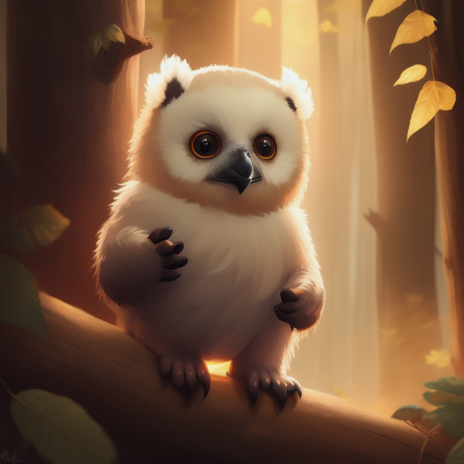
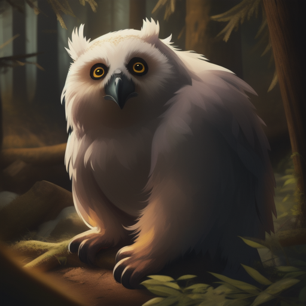
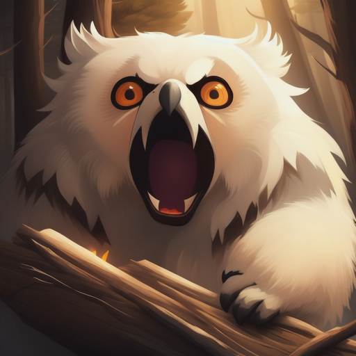
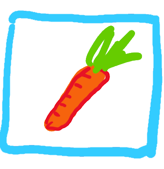
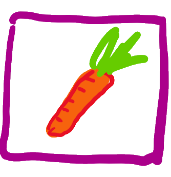
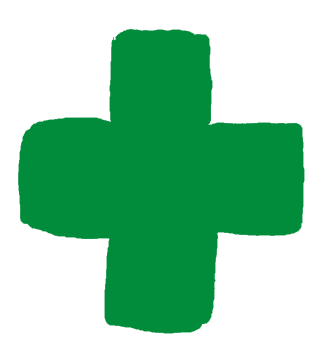
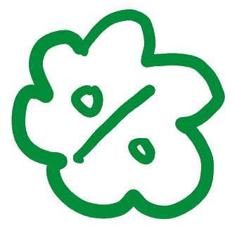
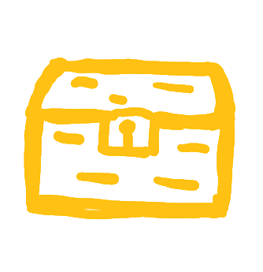

# Laboratorium z przedmiotu 'Programowanie obiektowe'

Instrukcje do poszczególnych laboratoriów znajdują się w odpowiednich folderach.

* [Git - rozproszony system kontroli wersji](lab0/Readme.md)
* [Instrukcje sterujące w Javie](lab1/Readme.md)
* [Model obiektowy](lab2/Readme.md)
* [Interakcje między obiektami](lab3/Readme.md)
* [Interfejsy i mapy](lab4/Readme.md)
* [Dziedziczenie](lab5/Readme.md)
* [Refactoring kodu](lab6/Readme.md)
* [Wielowątkowość](lab7/Readme.md)
* [Interfejs graficzny](lab8/Readme.md)

[Opis i wymagania do projektu.](proj/Readme.md)

Dodatkowe laboratoria do realizowania (opcjonalnie) w trakcie projektu:
* [Lambdy, streamy i zarządzanie zasobami](proj-lab1/Readme.md)
* [Kotlin jako alternatywa dla Javy](proj-lab2/Readme.md)
# Zasady oceniania

Na zajęciach będziemy zajmowali się zwierzakami. Dosłownie i w przenośni. Podczas kolejnych laborek oraz projektu będziemy rozwijali aplikację, w której stworzymy świat zapełniony florą i fauną. Nasze zwierzaki będą walczyć o to by nie zostać z pustym żołądkiem, a co za tym idzie - przetrwać.

Przetrwać muszą też jakoś studenci, chcący zaliczyć przedmiot Programowanie Obiektowe. Dlatego postanowiliśmy subtelnie powiązać te dwa światy i oprzeć cały system oceniania również o... opiekę nad zwierzakiem. 

Będzie to wyglądało następująco:

1. Na początek **nazwij swojego zwierzaka**. To ważne, bo dzięki temu będziesz mógł śledzić potem jego rozwój, a co za tym idzie swoje oceny w *Hall of Fame* wszystkich zwierzaków.

2. Twoim celem jest pielęgnować i rozwijać zwierzaka, dzięki czemu będzie on zdobywał punkty doświadczenia (**xp**). Doświadczenie zdobywasz poprzez:

   - Zrealizowanie wprowadzającego laboratorium z Gita (pierwsze spotkanie, maks. **4xp**)
   - Realizowanie w terminie zadań z **laboratoriów z Javy**   (8 spotkań, za każde maks. **4xp**)
   - Poprawne odpowiedzi na **kartkówkach** (8 spotkań, pierwsza kartkówka na drugim spotkaniu, za każdą **2xp**)
   - Zrealizowanie dużego **projektu** (w drugiej części semestru, maks. **32xp**)

3. Łącznie Twój zwierzak może zdobyć w ten sposób maksymalnie **84xp**. W trakcie zdobywania doświadczenia Twój zwierzak będzie awansował na kolejne poziomy doświadczenia, które wiążą się też z oceną końcową:

   |                                                              | poziom doświadczenia  | xp        | ocena |
   | ------------------------------------------------------------ | --------------------- | --------- | ----- |
   |  | Jajo                  | <0, 25)   | 2.0   |
   |  | Pisklak               | <25, 50)  | 2.0   |
   |  | Podlot                | <50, 60)  | 3.0   |
   |  | Żółtodziób            | <60, 70)  | 3.5   |
   |  | Nieopierzony odkrywca | <70, 80)  | 4.0   |
   |  | Samodzielny Zwierzak  | <80, 90)  | 4.5   |
   |  | Majestatyczna Bestia  | <90, 100) | 5.0   |

   

4. Aby zaliczyć przedmiot Twój zwierzak musi być **na koniec** co najmniej **Podlotem** oraz powinien zdobyć co najmniej **16xp** w trakcie Projektu. Ponadto musi on **wykluć się z Jaja** przed końcem laboratoriów. 

5. Dodatkowo w trakcie całego semestru będzie można zdobywać wraz z zwierzakiem łupy za wykonywanie dodatkowych, opcjonalnych aktywności. Łupy ułatwią zdobywanie xp, a nawet pozwolą pomnożyć jego wartość! **Wykonywanie dodatkowych aktywności to również jedyny sposób by zdobyć więcej niż 84xp, a co za tym idzie osiągnąć maksymalny poziom zwierzaka i ocenę 5.0.**

6. Rodzaje zdobywanych łupów:

   |                                                              | Nazwa łupu              | Znaczenie                                          |
   | ------------------------------------------------------------ | ----------------------- | -------------------------------------------------- |
   |  | Marchewka laboratoryjna | **+10%** do sumy za lab z Javy (maks. 30%)         |
   |  | Marchewka projektowa    | **+10%** do sumy za projekt (maks. 40%)            |
   |  | Lekarstwo               | odrobienie straconych **2xp** za lab               |
   |  | Weterynarz              | odrobienie straconych  **2xp** za kartkówkę        |
   |  | Rabat na sianko         | darmowe zaliczenie najbliższej kartkówki (**2xp**) |

7. Wykonanie dodatkowej aktywności skutkuje otrzymaniem skrzynki z jednym łupem. W zależności od rodzaju aktywności skrzynka może mieć różnią wartość, a co za tym idzie - mieć różną ilość łupów do wyboru. W momencie zdobycia skrzynki to Ty decydujesz, jaki łup zdobywasz. Zostaje on aktywowany niezwłocznie po zdobyciu.

 | Symbol skrzynki                                              | Zawartość (do wyboru jeden z wymienionych)                   | Rodzaj aktywności                                           |
   | ------------------------------------------------------------ | ------------------------------------------------------------ | ----------------------------------------------------------- |
   |  |  | Quizy na wykładzie                                          |
   |  |  | Zadania dodatkowe, Wydarzenia specjalne, Quizy na wykładzie |
   |  |  | Wydarzenia specjalne, Quizy na wykładzie            |

8. W trakcie semestru pojawią się liczne okazje do zdobycia skrzynek z łupami. Za każdą aktywność będzie można zdobyć jedną lub dwie skrzynki. Rodzaje dodatkowych aktywności:

   - **Zadania dodatkowe -** w niektórych konspektach do laboratoriów z Javy pojawią się dodatkowe, opcjonalne zadania. Aby otrzymać skrzynkę z łupem należy wykonać zadanie w tym samym terminie, co podstawową część laboratorium. W części laboratoryjnej przewidzieliśmy 3 takie zadania (3 łupy). W części projektowej pojawią się 2 dodatkowe, całkowicie opcjonalne laboratoria do samodzielnego przerobienia. Za każde z nich będzie można otrzymać po 2 łupy (łącznie 4 łupy).
   - **Quizy na wykładzie** - na niektórych wykładach będzie można wziąć udział w krótkim quizie podsumowującym omawiane na nim zagadnienia. Osoby, które udzielą poprawne odpowiedzi otrzymają skrzynkę z łupem. Wartość skrzynki będzie zależała od prędkości odpowiedzi (najszybsze osoby otrzymają złotą skrzynkę).
   - **Wydarzenia specjalne** - podobnie jak zadania dodatkowe będą polegały na wykonaniu aktywności poza zajęciami. Będą one miały jednak określony czas trwania, dłuższy niż tydzień. Przewidujemy 2 takie wydarzenia, każde warte 2 łupy.

### FAQ

**Czego trzeba nauczyć się na kartkówkę?**

Kartkówka zawsze będzie dotyczyła tematu poruszanego na ostatnim wykładzie. Forma kartkówki to jedno pytanie zamknięte typu test wyboru z jedną poprawną odpowiedzią. Jeśli zajęcia lab są opóźnione względem wykładu to kartkówka ostatniego dotyczy wykładu, którego znajomość nie była jeszcze weryfikowana (np. jeśli mamy już wykład nr 3, a na lab była dopiero jedna kartkówka to kolejna dotyczy wykładu nr 2). Jeśli z kolei lab wyprzedza wykład to kartkówka nie odbywa się.

**Jak dokładnie działają mnożniki (marchewki)?**

Każda zdobyta marchewka zwiększa wartość wszystkich zdobytych xp za laboratoria z Javy lub projekt. Przykładowo, jeśli zwierzak  zdobędzie w trakcie lab 26xp (z 32 możliwych) oraz 3 marchewki to otrzyma sumarycznie `26 + 3*2,6 = 33,8xp`.

**Czy mogę wykorzystać marchewki zdobyte w trakcie lab na projekcie?**

Nie, marchewki działają zgodnie z ich oznaczeniami. W pierwszej części semestru zdobywamy marchewki laboratoryjne (maksymalnie 3). W drugiej części semestru, w trakcie projektu marchewki projektowe (maksymalnie 4).

**Czy marchewki laboratoryjne działają również na ćwiczenia z Gita?**

Nie, mnożą one jedynie punkty zdobywane w trakcie lab z Javy (8 spotkań).

**Czy mogę zachować na później zdobyte lekarstwo albo weterynarza?**

Nie, łupy aktywowane są niezwłocznie po zdobyciu. W szczególności jeśli zwierzak zdobył maksymalną liczbę xp za dotychczasowe kartkówki, wizyta u weterynarza nie przynosi żadnego efektu. W przypadku lekarstw działają one również na ułamki straconych xp, regenerując maksymalnie 2xp. Przykładowo, jeśli z Lab1 zdobyliśmy 3 z 4xp, a z Lab2 3.5 z 4xp to zastosowanie lekarstwa uzupełni nam brakujące 1.5xp. 

**Skąd wiadomo jaki kolor skrzynki otrzymam za daną aktywność?**

Rodzaje skrzynek z łupami są zawsze określane w konspekcie lub przez prowadzącego.  

**Co się stanie, jeśli nie zdobędę wystarczająco xp by wykluć zwierzaka z Jaja przed startem projektu?**

W takiej sytuacji należy normalnie wziąć udział w projekcie, ale liczyć się z koniecznością zaliczenia przedmiotu w terminie poprawkowym. Rezultat projektu może wpłynąć na ocenę uzyskaną w terminie poprawkowym. 

**Czy muszę brać udział w quizach na wykładzie by mieć szansę na 5.0?**

Absolutnie nie! Zarówno wykłady, jak i quizy na nich są nieobowiązkowe. Aby zdobyć maksymalną liczbę marchewek (mnożników) wystarczy zrobić np. dodatkowe zadania, które pojawiają się na niektórych laborkach - będą dokładnie 3 takie zadania w trakcie części laboratoryjnej i 4 w trakcie części projektowej. Ponadto można też brać udział w wydarzeniach specjalnych. Co więcej, zdobycie wszystkich możliwych marchewek i zrobienie zadań na max punktów pozwala w teorii nawet przekroczyć 100% możliwych do zdobycia punktów doświadczenia. Quizy na wykładzie to po prostu jeszcze jedna okazja by zdobyć nagrody.

